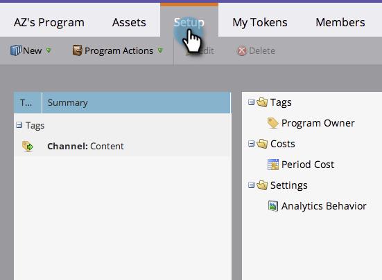
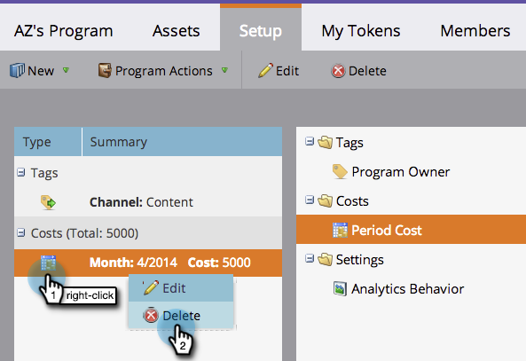
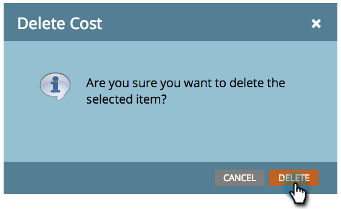

# 在方案中使用期間成本{#using-period-costs-in-a-program}

[期間成本](/help/marketo/product-docs/core-marketo-concepts/programs/working-with-programs/understanding-period-costs.md)是您在計畫上花費的金額。 它可持續一個或多個月，用於報告投資報酬率。

## 添加期間成本{#add-a-period-cost}

1. 轉到程式的&#x200B;**Setup**&#x200B;頁籤。

   

1. 將&#x200B;**期間成本**&#x200B;拖放到畫布中。

   

1. 按一下日曆圖示。 選擇月份。 按一下&#x200B;**確定**。

   

1. 輸入&#x200B;**期間成本**（不含小數或逗號）。 按一下&#x200B;**保存**。

   >[!NOTE]
   >
   >這可以是估計。 一旦知道確切金額，您隨時可以編輯期間成本（請參閱下一節）。

   

1. 成本會顯示在方案中。

   

   >[!TIP]
   >
   >您可以將多個期間成本拖放至畫布中。 這可讓您將不同期間成本的多個月份歸因於您的方案。

## 編輯期間成本{#edit-a-period-cost}

1. 如果您花的錢比原先預計的多或少，則可編輯期間成本。

1. 轉到程式的&#x200B;**Setup**&#x200B;頁籤。

   

1. 按一下右鍵&#x200B;**期間成本**。 選擇&#x200B;**編輯**。

   

1. 進行編輯。 按一下&#x200B;**保存**。

   

## 刪除期間成本{#delete-a-period-cost}

1. 轉到程式的&#x200B;**Setup**&#x200B;頁籤。

   

1. 按一下右鍵&#x200B;**期間成本**。 選擇&#x200B;**刪除**。

   

1. 按一下&#x200B;**Delete**&#x200B;確認。

   

>[!MORELIKETHIS]
>
>* [瞭解期間成本](/help/marketo/product-docs/core-marketo-concepts/programs/working-with-programs/understanding-period-costs.md)
>* [按期間成本篩選方案報表](/help/marketo/product-docs/core-marketo-concepts/programs/program-performance-report/filter-a-program-report-by-period-cost.md)

