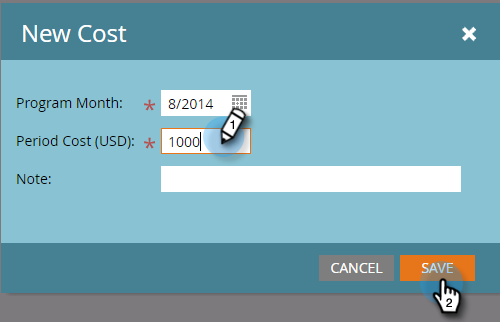

# 在方案中使用期間成本 {#using-period-costs-in-a-program}

A [期間成本](/help/marketo/product-docs/core-marketo-concepts/programs/working-with-programs/understanding-period-costs.md) 是你花在計畫上的錢。 可持續一個或多個月，用於報告ROI。

## 添加期間成本  {#add-a-period-cost}

1. 前往 **設定** 頁簽。

   

1. 拖放 **期間成本** 進入畫布。

   

1. 按一下日曆圖示。 選擇月。 按一下 **確定**.

   

1. 輸入 **期間成本** （不含小數或逗號）。 按一下 **儲存**.

   >[!NOTE]
   >
   >這可以是預估值。 在您知道確切金額後，您隨時可以編輯期間成本（請參閱下一節）。

   

1. 成本會顯示在方案中。

   

   >[!TIP]
   >
   >您可以將多個期間成本拖放至畫布中。 這可讓您將多個月的期間成本歸因於方案。

## 編輯期間成本 {#edit-a-period-cost}

1. 如果花費的資金比原來預計的要多或少，則可以編輯期間成本。

1. 前往 **設定** 頁簽。

   

1. 以滑鼠右鍵按一下 **期間成本**. 選擇 **編輯**.

   

1. 進行編輯。 按一下 **儲存**.

   

## 刪除期間成本 {#delete-a-period-cost}

1. 前往 **設定** 頁簽。

   

1. 以滑鼠右鍵按一下 **期間成本**. 選擇 **刪除**.

   

1. 按一下 **刪除** 確認。

   

>[!MORELIKETHIS]
>
>* [了解期間成本](/help/marketo/product-docs/core-marketo-concepts/programs/working-with-programs/understanding-period-costs.md)
>* [按期間成本篩選方案報表](/help/marketo/product-docs/core-marketo-concepts/programs/program-performance-report/filter-a-program-report-by-period-cost.md)

