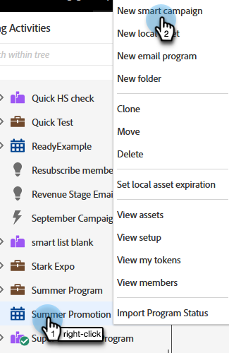

# 建立新的Smart Campaign {#create-a-new-smart-campaign}

Smart Campaigns是Marketo Engage最重要的工具。 他們可以針對一個人觸發並執行動作，或統計數百萬人並執行一系列流程步驟。

>[!TIP]
>
>進一步瞭解 [Smart Campaign](/help/marketo/product-docs/core-marketo-concepts/smart-campaigns/understanding-smart-campaigns.md){target="_blank"}.

1. 前往 **行銷活動**.

   

1. 以滑鼠右鍵按一下所需的程式，然後選取 **新增Smart Campaign**.

   

   >[!TIP]
   >
   >您可以建立Smart Campaigns作為任何計畫的本機資產。

1. 輸入Smart Campaign名稱並按一下 **建立**.

   

   接下來，瞭解如何使用智慧清單定義要透過Smart Campaign執行的人。

   >[!MORELIKETHIS]
   >
   >* [定義Smart Campaign的智慧清單 |批次](/help/marketo/product-docs/core-marketo-concepts/smart-campaigns/creating-a-smart-campaign/define-smart-list-for-smart-campaign-batch.md){target="_blank"}
   >* [定義Smart Campaign的智慧清單 |觸發器](/help/marketo/product-docs/core-marketo-concepts/smart-campaigns/creating-a-smart-campaign/define-smart-list-for-smart-campaign-trigger.md){target="_blank"}
