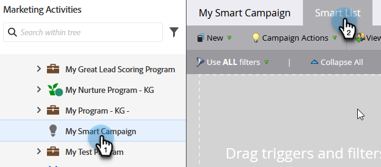

# 定義Smart Campaign的智慧清單 |觸發器 {#define-smart-list-for-smart-campaign-trigger}

透過新增觸發程式，根據即時事件逐人執行Smart Campaign。

1. 在Smart Campaign中，按一下 **智慧清單** 標籤。

   

1. 搜尋所需的觸發器，並將其拖放到畫布上。

   

   >[!NOTE]
   >
   >觸發器執行的Smart Campaign **觸發** 模式。 它會根據觸發的事件和任何其他篩選條件，一次只對一個人執行。

   >[!IMPORTANT]
   >
   >在觸發促銷活動智慧清單中使用布林欄位時，您必須明確將其設為「false」，讓欄位可在促銷活動執行期間正確評估。

1. 按一下下拉式清單，然後選擇運運算元。

   

   >[!CAUTION]
   >
   >紅色曲折線表示錯誤或遺失資訊。 如果未更正，行銷活動將無效且將無法執行。

   >[!TIP]
   >
   >在同時具有觸發器和篩選器的Smart Campaign中，觸發器會移至頂端，而且觸發時，只有符合篩選條件的人才會通過流量。

1. 定義觸發器。

   

   >[!NOTE]
   >
   >使用多個觸發程式時，個人會在下列情況下完成流程： **任何** 其中一個觸發程式啟動。

若要同時對一組人員執行行銷活動，請瞭解如何 [定義Smart Campaign的智慧清單 |批次](/help/marketo/product-docs/core-marketo-concepts/smart-campaigns/creating-a-smart-campaign/define-smart-list-for-smart-campaign-batch.md).

>[!MORELIKETHIS]
>
>[將流量步驟新增至Smart Campaign](/help/marketo/product-docs/core-marketo-concepts/smart-campaigns/flow-actions/add-a-flow-step-to-a-smart-campaign.md)
