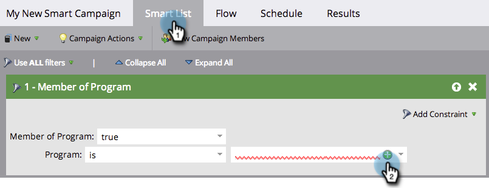

# Smart Campaign檢查清單 {#smart-campaign-checklist}

請依照下列步驟操作，確保Smart Campaign順利執行，並儘可能避免錯誤。

## 移除智慧清單錯誤 {#get-rid-of-smart-list-errors}

在Smart Campaign中，按一下 **智慧清單**. 修正錯誤，移除您所看到的任何紅色曲線線。

>[!TIP]
>
>紅色曲折線表示錯誤或遺失資訊。 如果未更正，行銷活動將無效且將無法執行。
>
>此外， **簡單明瞭**. 如果您有數十或數百個篩選器，就很難維護並追蹤。 數量較少的篩選器也會加快載入速度。

>[!NOTE]
>
>使用 **智慧清單的成員** 該其他清單中可能有錯誤。 也請到這裡檢視。

## 移除流量錯誤 {#get-rid-of-flow-errors}

在Smart Campaign中，按一下 **流量**. 修正錯誤，移除您所看到的任何紅色曲線線。

>[!TIP]
>
>將滑鼠懸停在紅色曲線上可檢視錯誤的詳細資訊。

## 檢閱「排程」標籤 {#review-the-schedule-tab}

在 **排程** 索引標籤，核取 **Smart** **清單** **狀態** Smart Campaign中任何需要修正的錯誤。

## 檢查人員限制限制 {#check-person-restrictions-limit}

在 **排程** 索引標籤中，確定符合資格的人數沒有超過人員限制限制。

>[!TIP]
>
>如有需要，您可以 [覆寫智慧行銷活動中的人員限制](/help/marketo/product-docs/core-marketo-concepts/smart-campaigns/using-smart-campaigns/override-person-restrictions-in-a-smart-campaign.md).

>[!NOTE]
>
>**提醒**
>
>如果您的Smart Campaign仍然失敗，請瞭解 [瞭解通知](/help/marketo/product-docs/core-marketo-concepts/miscellaneous/understanding-notifications.md) 找出問題，以及如何加以修正。

做得好！ 在執行Smart Campaign之前，請備妥此檢查清單。
