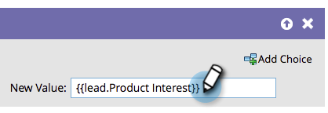

# 將資料附加至欄位 {#append-data-to-a-field}

有簡單的方式可將資料附加至欄位。 這是方法。

>[!PREREQUISITES]
>
>[建立促銷活動](/help/marketo/product-docs/core-marketo-concepts/smart-campaigns/creating-a-smart-campaign/create-a-new-smart-campaign.md)

>[!NOTE]
>
>下列步驟也適用於 [更改計畫成員資料](/help/marketo/product-docs/core-marketo-concepts/smart-campaigns/program-flow-actions/change-program-member-data.md).

1. 在 **流量** 標籤，拖入 **變更資料值** 流程步驟。

   

1. 尋找並選取您要附加資料的欄位。

   

1. 針對您要附加資料的相同欄位，尋找並選取代號。

   

1. 現在新增您要附加至欄位中已存在之值。

   

就這樣！ 您可以取得創意素材，並在其中新增多個代號。
