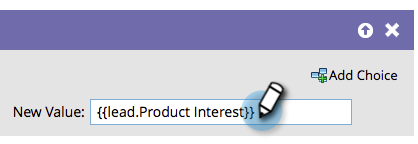

# 將資料附加至欄位 {#append-data-to-a-field}

直接將資料附加至欄位。

>[!PREREQUISITES]
>
>[建立行銷活動](/help/marketo/product-docs/core-marketo-concepts/smart-campaigns/creating-a-smart-campaign/create-a-new-smart-campaign.md){target="_blank"}

>[!NOTE]
>
>下列步驟也適用於[變更方案成員資料](/help/marketo/product-docs/core-marketo-concepts/smart-campaigns/program-flow-actions/change-program-member-data.md){target="_blank"}。

1. 在&#x200B;**[!UICONTROL Flow]**&#x200B;標籤下，拖曳至&#x200B;**[!UICONTROL Change Data Value]**&#x200B;流程步驟。

   

1. 尋找並選取您要附加資料的欄位。

   

1. 尋找並選取您要附加資料的相同欄位的Token。

   

1. 現在，新增您想要附加至欄位中已存在的值。

   

您可以在相同欄位中新增多個代號。
