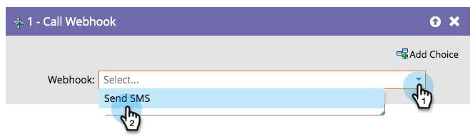

# 呼叫Webhook {#call-webhook}

>[!PREREQUISITES]
>
>[建立網頁連結](/help/marketo/product-docs/administration/additional-integrations/create-a-webhook.md)

## 總覽 {#overview}

Webhook可讓您與協力廠商服務互動。 呼叫智慧行銷活動流程中的網頁連結，以傳送/接收資訊。

>[!NOTE]
>
>了解許多有趣的事 [Webhook](https://developers.marketo.com/documentation/webhooks/) 可以幫你。

## 使用情況 {#usage}

選取 **Webhook** 從下拉式清單中。

僅此而已！ 現在，每當有人進入智慧型行銷活動流程時，就會叫用您的網頁連結。

>[!MORELIKETHIS]
>
>[在智慧型行銷活動中使用網頁連結](/help/marketo/product-docs/core-marketo-concepts/smart-campaigns/flow-actions/use-a-webhook-in-a-smart-campaign.md)
