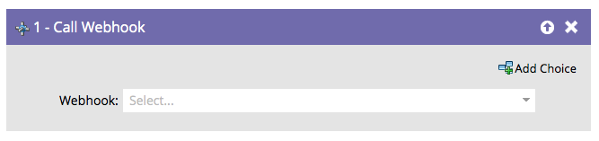

# 呼叫Webhook {#call-webhook}

>[!PREREQUISITES]
>
>[建立Webhook](/help/marketo/product-docs/administration/additional-integrations/create-a-webhook.md){target="_blank"}

Webhook可讓您與協力廠商服務互動。 透過在智慧行銷活動流程中呼叫webhook來傳送/接收資訊。

>[!NOTE]
>
>瞭解[Webhooks](https://experienceleague.adobe.com/en/docs/marketo-developer/marketo/webhooks/webhooks){target="_blank"}可以為您做許多有趣的事。

1. 從下拉式清單中選取Webhook。

僅此而已！ 現在每當有人進入智慧行銷活動流程時，就會叫用您的webhook。

>[!MORELIKETHIS]
>
>[在智慧行銷活動中使用Webhook](/help/marketo/product-docs/core-marketo-concepts/smart-campaigns/flow-actions/use-a-webhook-in-a-smart-campaign.md){target="_blank"}
