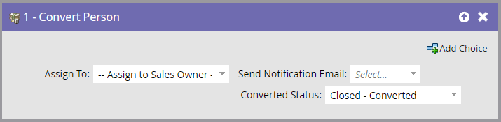

# 轉換人員 {#convert-person}

>[!NOTE]
>
>僅在與Salesforce整合時可用。

## 總覽 {#overview}

使用此流程步驟，在Salesforce中將人員轉換為聯繫人。 您可以決定要將聯繫人指派給誰、向所有者發送通知以及設定轉換狀態。

## 使用情況 {#usage}

1. 選取您要 **指派** 所產生的聯繫人、帳戶和機會。

   

   >[!CAUTION]
   >
   >在Marketo中轉換人員將在Salesforce中產生新帳戶和商機。 如果您不想要重複的帳戶，請使用Salesforce進行轉換。

1. 選擇是否要 **通知** 是否已發送給所有者。

   

1. 選取 **轉換狀態**.

   

就這樣！
