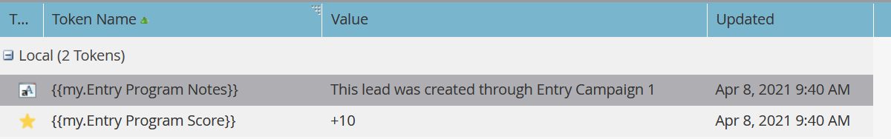

# 執行促銷活動{#execute-campaign}

可執行促銷活動和其他促銷活動一樣，包含智慧型清單、流量和排程。 與其他促銷活動不同，您實際上不會排程或啟動它。 只能由其他促銷活動透過「執行促銷活動」流程步驟呼叫。 可執行促銷活動中的流程步驟會與父促銷活動串連執行（與請求促銷活動不同，請求促銷活動會在個別的觸發促銷活動中並行執行）。

>[!NOTE]
>
>這項功能將於5月11日星期二晚上為所有Marketo實例啟用。

>[!NOTE]
>
>可執行促銷活動永遠是呼叫促銷活動的（父）子系。

## 何時使用執行促銷活動{#when-to-use-execute-campaign}

「可執行促銷活動」有許多功能可讓您執行。 它們可協助執行一般的作業工作，例如銷售線索路由、生命週期管理和計分（等等），並可用於從「批次」或「觸發式促銷活動」中執行相同的工作流程。

您也可以在需要運行單獨流時使用它們，但您需要在後續流步驟選擇中依賴該流的結果（即，如果這樣，請執行此操作）。

「執行促銷活動」是[「請求促銷活動」的改進，因為它可以串聯或並行執行，而後者僅並行執行。](/help/marketo/product-docs/core-marketo-concepts/smart-campaigns/flow-actions/request-campaign.md)

>[!NOTE]
>
>等待步驟和Webhook永遠不會與可執行促銷活動相容。 對於這些，您需要改用「請求促銷活動」。

## 如何建立可執行促銷活動{#how-to-create-an-executable-campaign}

1. 在所需程式上按一下滑鼠右鍵，然後選取「新增智慧型促銷活動」**。**

   

1. 為其指定名稱，選中&#x200B;**可執行**&#x200B;複選框，然後按一下&#x200B;**建立**。

   

1. 定義智慧型清單和流量，就像其他智慧型促銷活動一樣。

您也可以複製現有的智慧型促銷活動。 如果您複製現有的「可執行促銷活動」，則在命名後仍必須選取「可執行&#x200B;****」核取方塊。

>[!NOTE]
>
>您無法複製包含觸發器的促銷活動。

## 使用父促銷活動Token內容{#use-parent-campaign-token-context}

當設為true時，下列Token內容會傳送至子促銷活動（正在執行的Token內容）:

* 我的預付碼
* 促銷活動Token
* 方案Token
* 成員代號
* [觸發Token](/help/marketo/product-docs/marketo-sales-insight/msi-for-salesforce/features/tabs-in-the-msi-panel/interesting-moments/trigger-tokens-for-interesting-moments.md) （如果從觸發促銷活動呼叫）

**API互動**

在API](https://developers.marketo.com/rest-api/assets/smart-campaigns/#batch)中使用「排程」或「請求促銷活動」[時，兩者皆可讓您傳遞「我的代號」值，這會覆寫您所呼叫之促銷活動中這些代號的值設定。 如果該促銷活動接著執行其他促銷活動並將「使用父內容」設定為True，則會使用透過API傳遞的值，而非應用程式中設定的值。

## 注意事項{#things-to-note}

* 「智慧型清單」會篩選不符合資格的任何人。 如果某人符合資格，產生的「已執行促銷活動」活動記錄會將其列為「合格：TRUE」（若不正確則為FALSE）
* 套用「排程促銷活動資格規則」（「排程」標籤下的「智慧型促銷活動設定」）
* 無法跨工作區呼叫可執行促銷活動
* 如果您使用[從流中移除](/help/marketo/product-docs/core-marketo-concepts/smart-campaigns/flow-actions/remove-from-flow.md)以可執行促銷活動為目標的流動動作，它將同時鎖定子項和父項
* 善用代號繼承——例如，如果您有由多個不同資產觸發的單一共同計分流程，則可以在子促銷活動和父促銷活動中定義預設的「我的代號」分數，以便您覆寫父促銷活動的子分數促銷活動值（請參閱以下的視覺範例）
* 目前無法使用巢狀可執行檔促銷活動，但即將發行的版本將提供

>[!CAUTION]
>
>請勿將執行促銷活動的智慧型清單保留為無效，否則&#x200B;**沒有人有資格使用。**&#x200B;最佳實務是建立個別的智慧型清單資產、完整定義資產，並確定資產有效。 然後，使用「可執行促銷活動」中的「智慧型清單成員」篩選器，以便交換智慧型清單定義。

## 代號繼承範例{#token-inheritance-example}

以下是一個可執行促銷活動和兩個父促銷活動中代號繼承的視覺範例：一個標籤上下文設為&#x200B;**True**，另一個設為&#x200B;**False**。

具有Token化變更分數的子促銷活動。

子促銷活動的「我的代號」。

**範例一- True**

在第一個父促銷活動的「執行促銷活動」流程步驟中，「使用父促銷活動Token內容」設定為&#x200B;**True**。

父促銷活動的「我的代號」。

結果：分數變更+10。

**範例二：False**

在第二個父促銷活動的「執行促銷活動」篩選器中，「使用父促銷活動Token內容」設定為&#x200B;**False**。

父促銷活動的「我的代號」。

結果：分數不變，因為使用子促銷活動的分數值+0。

