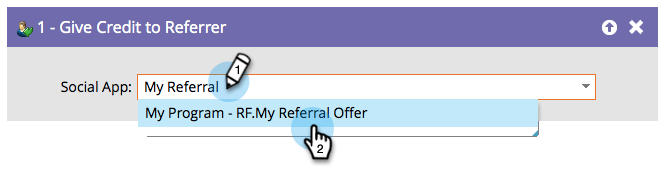

# 歸功於推薦者 {#give-credit-to-referrer}

執行&#x200B;_轉介優惠方案_&#x200B;或&#x200B;_抽獎_&#x200B;時，您可以使用不同方法將評分給予轉介者：

* 推薦造訪
* 引用的註冊
* **智慧清單觸發程式**
* 自訂JavaScript事件

如果您選擇使用&#x200B;**智慧清單觸發程式**&#x200B;選項來指定目標，則需要使用&#x200B;**[!UICONTROL Give Credit to Referrer]**&#x200B;流程步驟。

1. 當您建立行銷活動並決定要觸發什麼動作後，只要尋找並選取您要給予反向連結評分的社交應用程式即可。

   

   >[!NOTE]
   >
   >確認您的社交應用程式已設定為使用智慧清單觸發程式。 如需詳細資訊，請參閱&#x200B;_指定轉介選件的目標_。

太好了！ 此流程步驟處理的任何人員現在都會將評分給予其反向連結。
