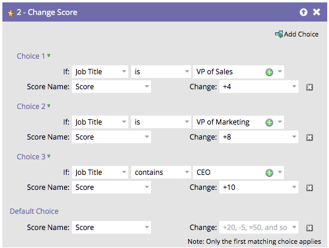
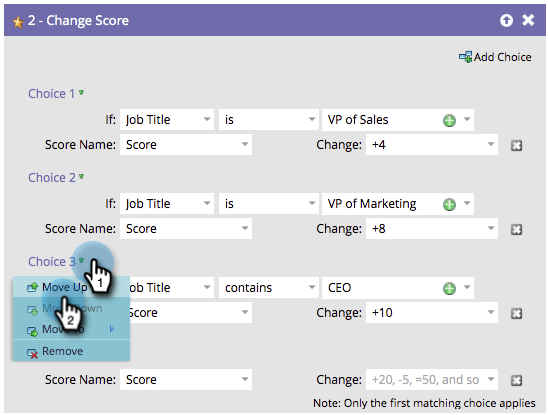

# 重新排序在流程步驟中新增選擇 {#reorder-add-choice-in-a-flow-step}

由於只有第一個相符選擇適用於個人，因此排序很重要。 如果您想要變更流程步驟中設定的條件順序，以下說明變更順序。

1. 尋找您要變更選擇順序的流程步驟。

   

1. 在此範例中，我們將選擇3移至選擇2的上方。 按一下&#x200B;**[!UICONTROL Choice 3]**，然後按一下&#x200B;**[!UICONTROL Move Up]**。

   

   >[!NOTE]
   >
   >重新排序時，您可以&#x200B;**[!UICONTROL Move Up]**、**[!UICONTROL Move Down]**&#x200B;或&#x200B;**[!UICONTROL Move To]**。

   做得好！ 現在您知道如何以單次增量上下移動選擇。

   

**選擇性步驟**：如果您有許多選擇，而且需要上下移動一個多重層級，您可以使用此替代方法以節省一些時間。 按一下您要移動的選項，然後在&#x200B;**[!UICONTROL Move To]**&#x200B;下方，將滑桿拖曳至您要移動選項的位置。

可以輕鬆重新組織流程步驟選擇的順序。
