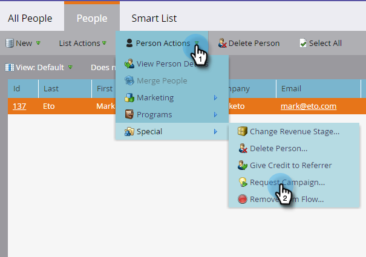

# 要求促銷活動 {#request-campaign}

您可以使用 **要求促銷活動** 單一流程步驟。

>[!NOTE]
>
>您要放置人員的促銷活動必須有效，且 **[已請求促銷活動](/help/marketo/product-docs/core-marketo-concepts/smart-campaigns/using-smart-campaigns/setting-up-a-trigger-smart-campaign-for-sales-using-campaign-is-requested.md)** 觸發。

1. 在 **資料庫**，尋找並選取所需的人員/人員。

   

1. 按一下 **人員動作**，暫留 **特殊**，然後選取 **要求促銷活動**.

   

1. 選取您要將人員放入的促銷活動，然後按一下 **立即運行**.

   

1. 在螢幕的右上角，您會看到它完成的時間。 按一下 **查看結果**.

   

   您的人員現在已進入「請求的促銷活動」。

   

   太棒了！

>[!TIP]
>
>使用 **已請求促銷活動** 觸發或篩選，以尋找受此流程步驟影響的人員。
