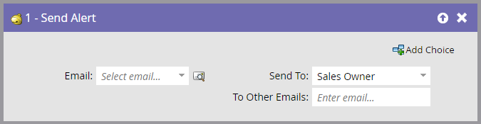

# 傳送警報 {#send-alert}

Marketo Engage可以傳送包含人員資訊的電子郵件警報給任何人 — 銷售負責人、合作夥伴或其他人。 使用&quot;[!UICONTROL Send Alert]&quot;流程步驟。

1. 尋找並選取您要傳送的電子郵件。

   

   >[!NOTE]
   >
   >您的電子郵件警示必須包含所有標頭資訊，並且處於&#x200B;**[!UICONTROL Approved]**&#x200B;狀態。

1. 您可以按一下預覽圖示，以確保您已選取正確的電子郵件。

   

   >[!NOTE]
   >
   >請務必在電子郵件中使用&quot;[!UICONTROL Send Alert Info]&quot;權杖。

1. 選取警示收件者。 您可以選擇[!UICONTROL Sales Owner]或[!UICONTROL Account Owner]。

   

1. 或者，您也可以新增您想要的其他電子郵件地址（以逗號或分號分隔）。

   

   >[!TIP]
   >
   >在觸發行銷活動中，只要值是有效的電子郵件地址，您就可以在&#x200B;**[!UICONTROL To Other Emails]** （例如`{{lead.Territory Owner}}`或`{{my.Alert Recipient}}`）中使用代號。 **[!UICONTROL To Other Emails]**&#x200B;中的Token無法在批次行銷活動中運作。

>[!MORELIKETHIS]
>
>[建立電子郵件](/help/marketo/product-docs/email-marketing/general/creating-an-email/create-an-email.md){target="_blank"}
