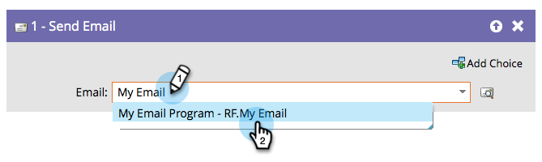

# 傳送電子郵件 {#send-email}

「[!UICONTROL 傳送電子郵件]」流程步驟可以做為行銷活動的一部分，或當作傳送電子郵件給您的人員的單一流程步驟。

您可以直接從流程步驟預覽所選電子郵件。

1. 尋找並選取您要傳送的電子郵件。

   

   >[!NOTE]
   >
   >若要在流程步驟中選取電子郵件，則必須核准該電子郵件。

1. 按一下預覽圖示以檢視目前選取的電子郵件。

   

新標籤/視窗隨即開啟，您可在其中檢視電子郵件。
