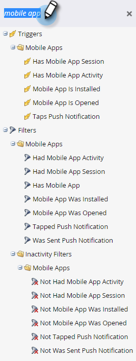

# 行動智慧型行銷活動的觸發器和篩選器 {#triggers-and-filters-for-mobile-smart-campaigns}

您可以為行動應用程式智慧行銷活動設定觸發器和篩選器。

對於大多數活動，都有觸發器、篩選器和非使用狀態篩選器。 使用非活動篩選器追蹤動作，例如點選推播通知，可 *沒有* 發生。

* 行動應用程式已安裝
* 行動應用程式已開啟
* 有/曾經有行動應用程式活動
* 具有/曾具有行動應用程式工作階段
* 點選/點選行動推播通知

此活動只有篩選器：

* 已傳送推播通知 — 篩選和非活動篩選

搜尋 **行動應用程式** 在右側面板中，列出所有行動應用程式觸發器和篩選器。

## 限制 {#constraints}

將限制與觸發器和篩選器搭配使用，以進一步排序資料。

除了「已傳送推播通知」之外，所有觸發器和篩選器都包含這兩個標準限制：

* 裝置型別 — iPod、iPhone、iPhone 6 Plus、iPad mini、iPad、Android智慧型手機、Android平板電腦、未知（這是預設集清單）

* 平台 — iPhone或Android

有些觸發器和篩選器提供其他限制，例如：

* 應用程式版本 — 一種鎖定非最新版本使用者的方式。 例如，如果最新的應用程式版本是2.0，您可以用它來尋找不在應用程式版本2.0上的使用者

* 安裝來源 — 目前，唯一的選項是API

* 地區 — 裝置上的設定

* 行動應用程式 — 特定應用程式的名稱。 指定是否有多個

* 平台版本 — 作業系統的版本

* 工作階段長度（秒） — 應用程式於前景的工作階段時間

* 是否啟用推播 —  **真** 表示可以傳送推播通知。 **假** 這表示他們無法；例如，該人員可能選擇不接收推播通知

## 觸發器和篩選器 {#triggers-and-filters}

**擁有行動應用程式**

使用此篩選條件來找出所有已安裝您應用程式的使用者。 這僅可作為篩選使用。

>[!NOTE]
>
>由於Marketo不會追蹤應用程式解除安裝，篩選器會找到目前和先前的安裝。

**限制**  — 裝置型別、平台、行動應用程式、行動應用程式版本、裝置型別、安裝來源、已啟用推播，以及地區設定

>[!TIP]
>
>最佳實務是指定具有行動應用程式= true且已啟用推播= true ，以及在定義應接收推播通知的智慧清單時，指定行動應用程式的名稱。

行動應用程式已安裝

* 行動應用程式已安裝 — 觸發器

* 行動應用程式已安裝 — 篩選器

* 未安裝行動應用程式 — 非使用狀態篩選器

**限制**  — 裝置型別、平台、應用程式版本、地區設定和安裝來源

行動應用程式已開啟

* 行動應用程式已開啟 — 觸發器

* 行動應用程式已開啟 — 篩選

* 未開啟行動應用程式 — 非使用狀態篩選器

**限制**  — 裝置型別和平台

有/曾經有行動應用程式活動

這些提供強大的方式可追蹤自訂行動活動。 您必須與開發人員合作才能設定追蹤 [適用於Android](https://developers.marketo.com/documentation/mobile/installation-instructions-on-android) 和 [適用於iOS](https://developers.marketo.com/documentation/mobile/installation-instructions-on-ios).

* 具有行動應用程式活動 — 觸發器

* 擁有行動應用程式活動 — 篩選器

* 沒有行動應用程式活動 — 非活動篩選器

**限制**  — 裝置型別、平台、行動應用程式版本、地區設定、平台版本，外加五個其他專案：

* 動作 — 自訂行動活動

* 動作型別 — （選用）用來分類多個動作的文字欄位

* 動作詳細資訊 — （選用）提供有關動作的額外資訊的文字欄位

* 動作量度 — （選用）提供有關動作的額外資訊的數字欄位（例如價格）

* 動作長度（秒） — （選用）數值欄位，可用於擷取使用者完成動作所需的時間

動作限制可讓您使用觸發器和篩選器密切追蹤行動活動。

>[!NOTE]
>
>**範例**
>
>在動作型別底下 *購物*，此為非常明確的動作，其他限制對其定義：
>
>* 已購買一件襯衫
>   * 它是紅色的
>   * 成本$30
>   * 購買花了20秒

以下為篩選器在Marketo中的外觀：

>[!NOTE]
>
>**範例**
>
>在相同動作型別下，您可以有多個動作。 事實上，您的一般購物體驗可能包括「購物」底下的數個欄！ 來點襪子吧？
>
>| 動作型別 | 購物 | 購物 |
>|---|---|---|
>| 動作 | 買的襯衫 | 買來的褲子 |
>| 動作詳細資料 | 顏色 | 顏色 |
>| 動作量度 | 價格 | 價格 |

**具有/曾具有行動應用程式工作階段**

* 具有行動應用程式工作階段 — 觸發器

* 擁有行動應用程式工作階段 — 篩選器

* 沒有行動應用程式工作階段 — 非使用狀態篩選器

**限制**  — 裝置型別、平台和工作階段長度（秒）

點選/點選推播通知

* 點選推播通知 — 觸發器

* 已點選的推播通知 — 篩選器

* 未點選的推播通知 — 非使用狀態篩選器

**限制**  — 裝置型別、平台、行動應用程式版本、推播通知和平台版本

>[!TIP]
>
>使用「未點選的推播通知」非使用狀態篩選器來尋找最近未點選推播通知的訪客，以便您透過電子郵件追蹤。

**已傳送推播通知** 此活動僅可作為篩選使用。

* 已傳送推播通知 — 篩選器

* 未傳送推播通知 — 非使用狀態篩選器

**限制**  — 推播通知與行動應用程式

>[!MORELIKETHIS]
>
>* [新增限制至智慧清單篩選器](/help/marketo/product-docs/core-marketo-concepts/smart-lists-and-static-lists/using-smart-lists/add-a-constraint-to-a-smart-list-filter.md)
>* [在智慧清單中使用非使用中篩選器](/help/marketo/product-docs/core-marketo-concepts/smart-lists-and-static-lists/using-smart-lists/use-inactivity-filters-in-a-smart-list.md)
