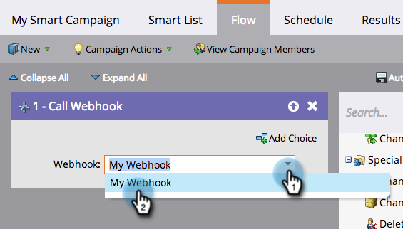

# 在智慧型促銷活動中使用網頁掛接{#use-a-webhook-in-a-smart-campaign}

若要使用[webhook](https://developers.marketo.com/documentation/webhooks/)，請將它新增至[智慧型促銷活動](/help/marketo/product-docs/core-marketo-concepts/smart-campaigns/flow-actions/add-a-flow-step-to-a-smart-campaign.md)作為流量動作。

>[!AVAILABILITY]
>
>並非所有客戶都購買過此功能。 如需詳細資訊，請洽詢您的銷售代表。

1. [建立智慧型促銷活動](/help/marketo/product-docs/core-marketo-concepts/smart-campaigns/creating-a-smart-campaign/create-a-new-smart-campaign.md)。

   >[!NOTE]
   >
   >Webhook只能用於觸發促銷活動。

1. 轉至&#x200B;**Flow**&#x200B;標籤，並拖曳至&#x200B;**Call Webhook** flow動作。

   

1. 選擇Webhook。

   

1. 您也可以在智慧型清單中使用Webhook。

   

1. 最後，您可以在流程步驟中使用&#x200B;**新增選擇**&#x200B;中的Webhook。

   
