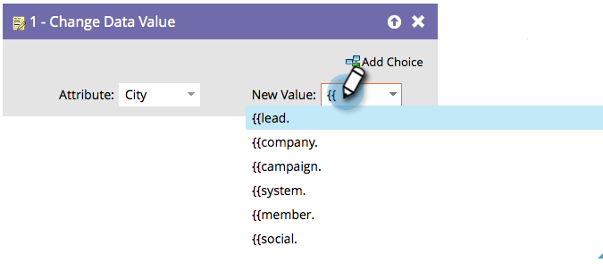

# 在流程步驟中使用權杖 {#use-tokens-in-flow-steps}

>[!PREREQUISITES]
>
>[將流程步驟新增至Smart Campaign](/help/marketo/product-docs/core-marketo-concepts/smart-campaigns/flow-actions/add-a-flow-step-to-a-smart-campaign.md){target="_blank"}

代號是變數。 您可在電子郵件、登陸頁面和智慧型行銷活動中使用，讓您的生活更輕鬆。 您可以在流程步驟、Webhook、電子郵件和登入頁面中使用[我的權杖](/help/marketo/product-docs/core-marketo-concepts/programs/tokens/understanding-my-tokens-in-a-program.md){target="_blank"} （自訂權杖）。 您可以使用代號，將變數內容納入這些流程步驟中：

* 變更資料值
* 變更方案成員資料
* 精彩時刻
* [!DNL Salesforce]個行銷活動步驟（新增、移除、變更狀態）
* 建立任務
* 傳送警報（僅限觸發促銷活動）

1. 在流程步驟中，開始輸入`{{`以取得Token類別。

   

   >[!NOTE]
   >
   >檢視[Token概述](/help/marketo/product-docs/demand-generation/landing-pages/personalizing-landing-pages/tokens-overview.md){target="_blank"}，以取得數個可用Token的清單。

1. 繼續輸入，直到找到您想要的Token並按一下以選取。

   

   >[!TIP]
   >
   >可在「有趣的時刻」、「建立任務」和「傳送警報」流程步驟中使用多個權杖。

   >[!NOTE]
   >
   >方案成員自訂欄位權杖可用於：建立任務、在Microsoft中建立任務、有趣的時刻、變更資料值流程動作和Webhook。

   酷！ 當Smart Campaign執行時，將會從Token提取資料。

   >[!MORELIKETHIS]
   >
   >* [管理我的Token](/help/marketo/product-docs/core-marketo-concepts/programs/tokens/managing-my-tokens.md){target="_blank"}
   >* [瞭解程式中的我的Token](/help/marketo/product-docs/core-marketo-concepts/programs/tokens/understanding-my-tokens-in-a-program.md){target="_blank"}
