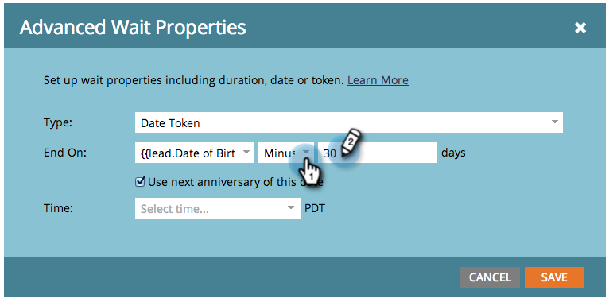

# 在等待流程步驟中使用日期權杖 {#use-a-date-token-in-a-wait-flow-step}

您可以使用等待流程步驟來暫停使用者通過Smart Campaign的歷程，直到使用日期權杖的特定日期為止。 您也可以將結束日期修改幾天。

>[!NOTE]
>
>這僅適用於觸發行銷活動。 您無法在批次行銷活動中使用此功能。

1. 在您的Smart Campaign **[!UICONTROL 流量]**&#x200B;索引標籤中，拖曳到&#x200B;**[!UICONTROL 等待]**&#x200B;流量步驟。

   

1. 按一下齒輪圖示。

   

1. 從&#x200B;**[!UICONTROL 型別]**&#x200B;下拉式清單中，選取&#x200B;**[!UICONTROL 日期權杖]**。

   

1. 選擇日期Token ，以指定等待步驟的結束時間：

   * `{{my._____}}`
   * `{{lead.______}}`
   * `{{company.______}}`
   * `{{system._______}}`

   

1. 若要等到目前或下一個日曆年度中出現的日期的下一個週年紀念日，請核取方塊。

   

   >[!TIP]
   >
   >在參考過去日期（例如生日或合約開始日期）的日期權杖上使用此選項。

1. 或者，您可以依指定天數修改結束日期。

   

   >[!NOTE]
   >
   >您也可以使用代表整數欄位的`{{lead.`或`{{company.`權杖或數字型別的`{{my.`權杖來指定天數。

1. 按一下&#x200B;**[!UICONTROL 保存]**。

   

   >[!MORELIKETHIS]
   >
   >* [在等待流程步驟中使用持續時間](/help/marketo/product-docs/core-marketo-concepts/smart-campaigns/flow-actions/wait/use-a-duration-in-a-wait-flow-step.md){target="_blank"}
   >* [在等待流程步驟中使用特定日期](/help/marketo/product-docs/core-marketo-concepts/smart-campaigns/flow-actions/wait/use-a-specific-date-in-a-wait-flow-step.md){target="_blank"}
