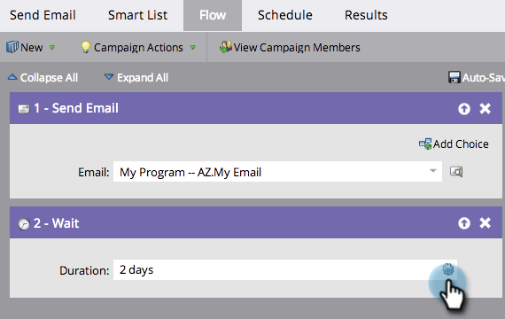

# 在等待流程步驟中使用持續時間 {#use-a-duration-in-a-wait-flow-step}

您可以使用等待流程步驟，將個人穿過Smart Campaign的歷程暫停一段特定時間。 您也可以指定星期幾的標準以及結束的時間。

1. 在您的Smart Campaign **[!UICONTROL Flow]**&#x200B;標籤中，拖曳至&#x200B;**[!UICONTROL Wait]**&#x200B;流程步驟上。

   

1. 輸入您要暫停多久。

   

1. 完成了！流量將在您指定的期間內暫停。 如需進階選項，請按一下右側的齒輪圖示。

   

1. 指定一週中等待步驟的結束日期。

   

1. 選擇性地指定時間。 按一下「**[!UICONTROL Save]**」。

   

   >[!NOTE]
   >
   >**範例**
   >
   >有人在星期五下午5點觸發Smart Campaign。 等待步驟已提前：48小時，必須在週一至週五上午9點結束。
   >
   >結果該人員將在&#x200B;**星期一，上午9點**&#x200B;繼續進入流量。 這是48小時後的第一個M-F日期。

   >[!NOTE]
   >
   >使用的持續時間、日期、時間和天數都取決於您的訂閱時區。

   >[!MORELIKETHIS]
   >
   >* [在等待流程步驟中使用特定日期](/help/marketo/product-docs/core-marketo-concepts/smart-campaigns/flow-actions/wait/use-a-specific-date-in-a-wait-flow-step.md){target="_blank"}
   >* [在等待流程步驟中使用日期權杖](/help/marketo/product-docs/core-marketo-concepts/smart-campaigns/flow-actions/wait/use-a-date-token-in-a-wait-flow-step.md){target="_blank"}
