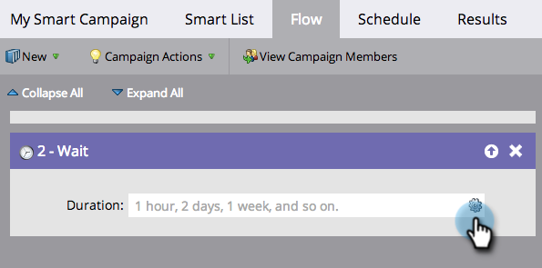

# 在等待流程步驟中使用特定日期 {#use-a-specific-date-in-a-wait-flow-step}

您可以使用&quot;[!UICONTROL Wait]&quot;流量步驟，將個人穿過Smart Campaign的歷程暫停至特定日期。

1. 在您的Smart Campaign **[!UICONTROL Flow]**&#x200B;標籤中，拖曳至&#x200B;**[!UICONTROL Wait]**&#x200B;流程步驟上。

   

1. 按一下齒輪圖示。

   

1. 從&#x200B;**[!UICONTROL Type]**&#x200B;下拉式清單中選取&#x200B;**[!UICONTROL Date]**。

   

1. 選取您要繼續的特定日期。

   

1. 指定時間（選擇性）並按一下&#x200B;**[!UICONTROL Save]**。

   

>[!MORELIKETHIS]
>
>* [在等待流程步驟中使用持續時間](/help/marketo/product-docs/core-marketo-concepts/smart-campaigns/flow-actions/wait/use-a-duration-in-a-wait-flow-step.md){target="_blank"}
>* [在等待流程步驟中使用日期權杖](/help/marketo/product-docs/core-marketo-concepts/smart-campaigns/flow-actions/wait/use-a-date-token-in-a-wait-flow-step.md){target="_blank"}
