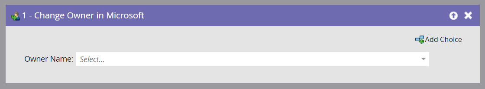

# 在 Microsoft 中變更所有者 {#change-owner-in-microsoft}

如果您的現有人員已指派給擁有者，您可以使用此流程步驟將其重新指派給其他擁有者。

>[!NOTE]
>
>此流程步驟只有在您的Smart Campaign中搭配觸發器&#x200B;_使用時，_&#x200B;才能運作，而非篩選器。

**使用狀況**

1. 只要選擇您要變更的擁有者並前往即可！

   

   >[!NOTE]
   >
   >如果記錄尚未存在於您的Dynamics帳戶中，我們會同步處理該記錄，然後將其指派給選取的使用者。
