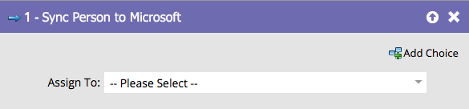

# 將人員同步至 Microsoft {#sync-person-to-microsoft}

此功能僅適用於將Marketo Engage與[!DNL Microsoft Dynamics]整合的使用者。

## 概觀 {#overview}

此流程步驟會將Marketo建立的人員插入您的[!DNL Dynamics] CRM。

## 使用情況 {#usage}

您可以將[!DNL Dynamics]使用者設定為人員擁有者。

>[!NOTE]
>
>使用&quot;[!UICONTROL Sync Person to Microsoft]&quot;流量動作時（僅限在「觸發程式促銷活動」中），會在Dynamics中即時建立銷售機會/聯絡人。
