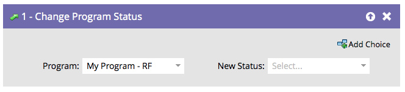

# 變更方案狀態 {#change-program-status}

計畫狀態可協助您追蹤人們進行計畫或活動的進度。 在[自訂、建立和管理頻道](/help/marketo/product-docs/administration/tags/create-a-program-channel.md){target="_blank"}中尋找更多資訊。

>[!CAUTION]
>
>變更參與計畫中的計畫狀態會自動將其新增到第一個資料流。 他們將會開始接收內容。

1. 拖曳至&#x200B;**[!UICONTROL 變更方案狀態]**&#x200B;流程步驟。

   

1. 選取您要設定的&#x200B;**[!UICONTROL 新狀態]**。 如果人員尚未成為計畫成員，則也會成為計畫成員。

   

選項僅限於該程式的有效狀態。

>[!NOTE]
>
>人員無法回到在Admin的管道編輯器中定義的舊版計畫狀態。

狀態是追蹤人員與報告的強大工具。
