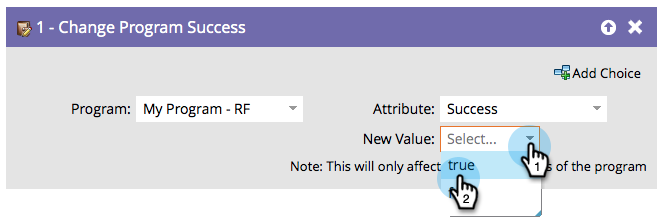

# 變更方案成功 {#change-program-success}

如果您有一組人員錯誤地標籤為方案成功，您可以使用此流程步驟將成功設為true或false。

1. 當您在此流程步驟中拖曳時，方案會自動設定為包含您正在編輯的智慧行銷活動的方案。

   >[!NOTE]
   >
   >只有計畫的成員會受到影響。

   

1. 選取&#x200B;**[!UICONTROL Success]**&#x200B;或&#x200B;**[!UICONTROL Success Date]**&#x200B;作為屬性。

   

   >[!NOTE]
   >
   >將[!UICONTROL Success Date]設為任何專案都會自動將Success設為true。 將[!UICONTROL Success]設定為true會自動將成功日期設定為目前日期。

1. 將&#x200B;**[!UICONTROL New Value]**&#x200B;設為&#x200B;**[!UICONTROL True]**&#x200B;或&#x200B;**[!UICONTROL False]**。

   

   >[!TIP]
   >
   >您可以使用兩次流程步驟來設定成功標幟和日期。

太棒了！ 現在您知道如何復原和強製成功了。
