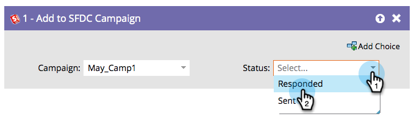

# 新增至SFDC Campaign {#add-to-sfdc-campaign}

此流程步驟可用於Marketo Engage行銷活動，或作為單一流程步驟，在Salesforce行銷活動中將人員新增為銷售機會。 如果Salesforce中尚未存在潛在客戶，則會自動將其同步並新增至具有指定狀態的促銷活動。

>[!NOTE]
>
>僅在與[!DNL Salesforce]整合時可用。

## 使用情況 {#usage}

1. 尋找並選取您要新增銷售機會的[!DNL Salesforce]行銷活動。

   

   >[!TIP]
   >
   >如果在行銷活動清單中看不到Salesforce行銷活動：
   >
   > 1. 確定已啟用[行銷活動同步處理](/help/marketo/product-docs/crm-sync/salesforce-sync/setup/optional-steps/enable-disable-campaign-sync.md){target="_blank"}。
   > 1. 確認您的[Marketo同步使用者](/help/marketo/product-docs/crm-sync/salesforce-sync/setup/enterprise-unlimited-edition/step-2-of-3-create-a-salesforce-user-for-marketo-enterprise-unlimited.md){target="_blank"}是Salesforce中的[行銷使用者](/help/marketo/product-docs/crm-sync/salesforce-sync/setup/optional-steps/enable-disable-campaign-sync/make-marketo-sync-user-a-marketing-user.md){target="_blank"}。

   >[!TIP]
   >
   >您可以使用Salesforce行銷活動[我的Token](/help/marketo/product-docs/core-marketo-concepts/programs/tokens/managing-my-tokens.md){target="_blank"}，更輕鬆復製程式。

1. 選取在新增潛在客戶時，您想要指派的[!DNL Salesforce]行銷活動成員狀態。

   

   >[!CAUTION]
   >
   >如果人員已經是Salesforce行銷活動的主要成員，則將略過他們且其狀態不會更新。 您可以改用[在SFDC行銷活動中變更其狀態](/help/marketo/product-docs/core-marketo-concepts/smart-campaigns/salesforce-flow-actions/change-status-in-sfdc-campaign.md){target="_blank"}。
