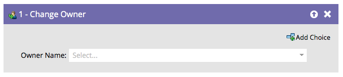

# 變更擁有者 {#change-owner}

如果您的現有人員已指派給擁有者，您可以使用此流程步驟將其重新指派給其他擁有者。

1. 只要選擇您想要變更的擁有者或潛在客戶佇列並開始！

   

   >[!CAUTION]
   >
   >Salesforce不允許將聯絡人指派給潛在客戶佇列。 對於SFDC連絡人記錄：
   >
   >* 當連絡人同步至Salesforce時，Marketo僅會建立重複的銷售機會&#x200B;**1&rbrace;。**&#x200B;換言之，如果您使用&#x200B;**[將人員同步至SFDC](/help/marketo/product-docs/core-marketo-concepts/smart-campaigns/salesforce-flow-actions/sync-person-to-sfdc.md)**&#x200B;流程步驟與`AssignTo=<a lead queue>`，Marketo會在Salesforce中建立重複的銷售機會，並將其指派給銷售機會佇列。
   >
   >* 如果您在聯絡人上使用&#x200B;**[!UICONTROL 變更擁有者]**&#x200B;流程步驟，Marketo會在Salesforce中建立重複的銷售機會。 若要避免此情況，請在「SFDC型別」欄位上使用篩選器，將動作限製為僅限銷售機會。

   >[!NOTE]
   >
   >如果記錄尚未存在於您的Salesforce帳戶中，我們會將其同步化，然後指派給所選使用者。
