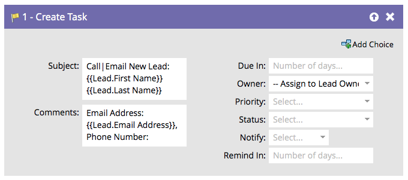

# 建立工作 {#create-task}

身為行銷人員，您擁有可協助銷售完成交易的資訊。 您可以建立任務，讓他們知道應該做什麼，以及何時應該做。

>[!NOTE]
>
>當Marketo Sync使用者建立任務時，**[!UICONTROL Due In]**&#x200B;為要在Salesforce中建立之任務的必要欄位。 如果沒有值，Marketo預設會輸入5天。

根據預設，流程步驟將如下所示：

自訂所有欄位，以您想要的方式建立任務。

>[!TIP]
>
>您可以在`{{lead.tokens}}`和`{{company.tokens}}`中使用`{{campaign.tokens}}`、`{{system.tokens}}`、**[!UICONTROL Subject]**&#x200B;和&#x200B;**[!UICONTROL Description]**。 如需詳細資訊，請參閱流程步驟[的](/help/marketo/product-docs/core-marketo-concepts/smart-campaigns/flow-actions/use-tokens-in-flow-steps.md){target="_blank"}權杖。
