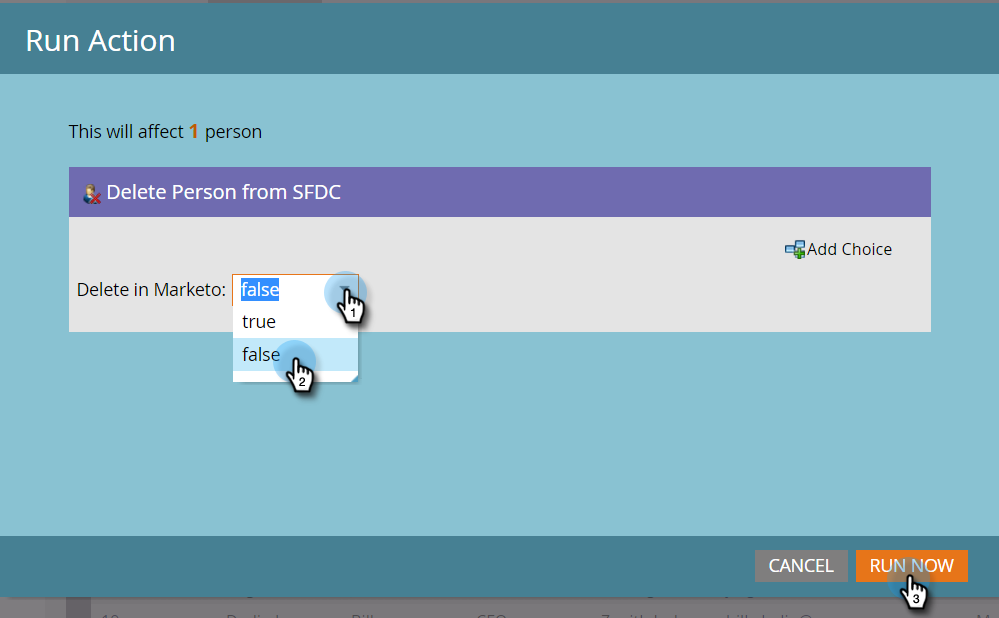

# 從 SFDC 中刪除人員 {#delete-person-from-sfdc}

如果您需要從Salesforce中移除一組特定的銷售機會，但保留為Marketo Engage中的人員，則可以使用從SFDC流程刪除人員動作。

>[!NOTE]
>
>僅在與[!DNL Salesforce]整合時可用。

1. 在資料庫中，按一下您要從Salesforce移除的人員。 然後按一下&#x200B;**[!UICONTROL Person Actions]**&#x200B;並選取&#x200B;**[!DNL Salesforce]**。

   

1. 選取「**[!UICONTROL Delete Person from SFDC]**」。

   

1. 確定&#x200B;**[!UICONTROL Delete in Marketo]**&#x200B;設定為&#x200B;**[!UICONTROL false]**，然後按一下&#x200B;**[!UICONTROL Run Now]**。

   

   流程步驟執行後，您的人員將不再是[!DNL Salesforce]中的銷售機會，但將保留在Marketo中。

   >[!CAUTION]
   >
   >如果您將&#x200B;**[!UICONTROL Delete in Marketo]**&#x200B;設為&#x200B;**[!UICONTROL true]**&#x200B;並從Marketo中刪除人員和Salesforce的銷售機會，則為永久性刪除。 此動作無法還原。
