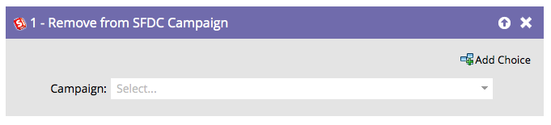

# 從 SFDC 行銷活動中移除 {#remove-from-sfdc-campaign}

就像您可以[新增至SFDC行銷活動](/help/marketo/product-docs/core-marketo-concepts/smart-campaigns/salesforce-flow-actions/add-to-sfdc-campaign.md){target="_blank"}和[在SFDC行銷活動中變更狀態](/help/marketo/product-docs/core-marketo-concepts/smart-campaigns/salesforce-flow-actions/change-status-in-sfdc-campaign.md){target="_blank"}一樣，您也可以從Salesforce行銷活動中移除人員或銷售機會。

>[!NOTE]
>
>僅在與[!DNL Salesforce]整合時可用。

1. 在流程步驟中拖曳之後，請尋找並選取您要從中移除人員或潛在客戶的Salesforce行銷活動。

   

   >[!TIP]
   >
   >如果人員或銷售機會不是您所選行銷活動的成員，則將略過這些人員或銷售機會。

當人員或銷售機會流經時，他們將會從您選擇的[!DNL Salesforce]行銷活動中移除。
