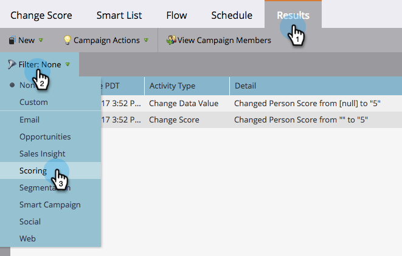

# 篩選智慧型促銷活動結果{#filter-smart-campaign-results}

>[!PREREQUISITES]
>
>[檢視智慧型促銷活動結果](/help/marketo/product-docs/core-marketo-concepts/smart-campaigns/smart-campaign-data/view-smart-campaign-results.md)

篩選智慧型促銷活動結果，以查看對您而言重要的特定活動。

## 依儲存的篩選{#filter-by-saved-filters}篩選

1. 在智慧型促銷活動&#x200B;**Results**&#x200B;標籤中，按一下&#x200B;**Filter**&#x200B;並選取儲存的篩選。

   

   >[!NOTE]
   >
   >依預設，不會套用任何篩選器，結果會顯示所有活動。

## 建立自訂篩選{#create-a-custom-filter}

1. 按一下「**篩選**」，然後按一下「自訂&#x200B;**」。**

   

1. 選擇您要查看的活動類型，然後按一下「另存為」。****

   

   >[!TIP]
   >
   >按一下&#x200B;**Apply**，直接將自訂篩選套用至結果，而不儲存。

1. 輸入篩選器名稱，然後按一下&#x200B;**保存**。

   

1. 自訂篩選器將套用至您的結果，現在可在下拉式清單中使用（您可能必須重新整理頁面，才能在下拉式清單中檢視它）。

   

   這不酷嗎？ 您的自訂篩選現在可用於所有活動記錄檔。
