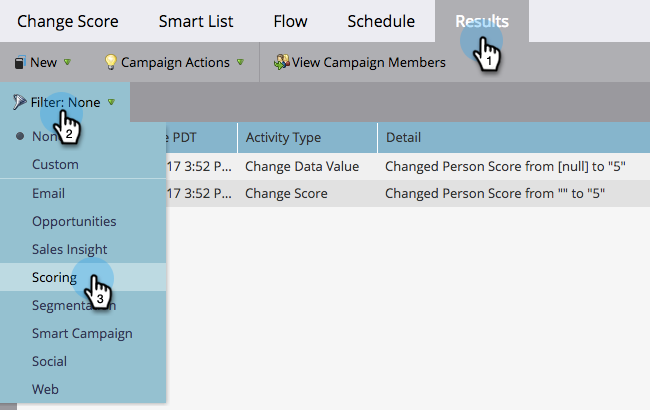

# 篩選智慧行銷活動結果 {#filter-smart-campaign-results}

>[!PREREQUISITES]
>
>[檢視Smart Campaign結果](/help/marketo/product-docs/core-marketo-concepts/smart-campaigns/smart-campaign-data/view-smart-campaign-results.md)

篩選Smart Campaign結果以檢視對您而言重要的特定活動。

## 依儲存的篩選器篩選 {#filter-by-saved-filters}

1. 在您的Smart Campaign **[!UICONTROL Results]**&#x200B;索引標籤中，按一下&#x200B;**[!UICONTROL Filter]**&#x200B;並選取已儲存的篩選器。

   

   >[!NOTE]
   >
   >預設不會套用篩選器，結果會顯示所有活動。

## 建立自訂篩選器 {#create-a-custom-filter}

1. 按一下&#x200B;**[!UICONTROL Filter]**，然後按&#x200B;**[!UICONTROL Custom]**。

   

1. 選取您要檢視的活動型別，然後按一下&#x200B;**[!UICONTROL Save As]**。

   

   >[!TIP]
   >
   >按一下&#x200B;**[!UICONTROL Apply]**&#x200B;直接將自訂篩選器套用至您的結果，而不儲存它。

1. 輸入篩選器名稱並按一下&#x200B;**[!UICONTROL Save]**。

   

1. 自訂篩選器將套用至您的結果，現在於下拉式清單中提供（您可能需要重新整理頁面，才能在下拉式清單中檢視它）。

   
