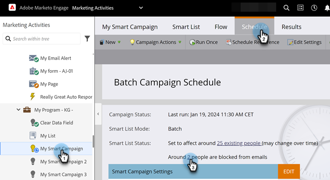

# 在Smart Campaign中檢視封鎖的人員 {#view-blocked-people-in-a-smart-campaign}

Marketo Engage資料庫中遭封鎖的人員會標籤為已列入封鎖名單、已取消訂閱、行銷活動已暫停，及/或電子郵件無效或空白。

1. 在您的Smart Campaign中，按一下&#x200B;**[!UICONTROL Schedule]**。 在&#x200B;**[!UICONTROL Smart List Status]**&#x200B;下，按一下第二個連結。

   

   >[!NOTE]
   >
   >達到通訊限制的人也可能遭到封鎖，無法接收郵件。 瞭解如何在管理員區段中[編輯通訊限制](/help/marketo/product-docs/administration/email-setup/enable-communication-limits.md){target="_blank"}。

   **[!UICONTROL Blocked Leads]**&#x200B;索引標籤顯示可能未收到郵件的人。

   

   >[!NOTE]
   >
   >營運電子郵件將傳送給標籤為已取消訂閱和行銷暫停的人員。

   >[!MORELIKETHIS]
   >
   >* [編輯資格規則](/help/marketo/product-docs/core-marketo-concepts/smart-campaigns/using-smart-campaigns/edit-qualification-rules-in-a-smart-campaign.md){target="_blank"}
   >* [啟用通訊限制](/help/marketo/product-docs/administration/email-setup/enable-communication-limits.md){target="_blank"}
   >* [檢視Smart Campaign成員](/help/marketo/product-docs/core-marketo-concepts/smart-campaigns/smart-campaign-data/view-smart-campaign-members.md){target="_blank"}
   >* [在Smart Campaign中檢視合格的人員](/help/marketo/product-docs/core-marketo-concepts/smart-campaigns/smart-campaign-data/view-qualified-people-in-a-smart-campaign.md){target="_blank"}
