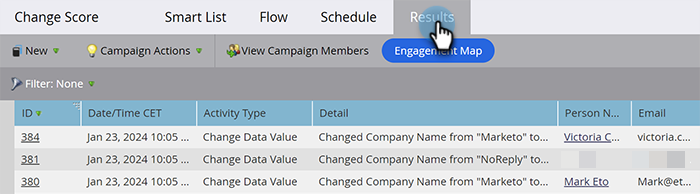

# 檢視Smart Campaign結果 {#view-smart-campaign-results}

想要檢視在Smart Campaign中發生的所有事情的劃分嗎？ 方法如下。

>[!TIP]
>
>您可以按一下[檢視行銷活動成員](/help/marketo/product-docs/core-marketo-concepts/smart-campaigns/smart-campaign-data/view-smart-campaign-members.md){target="_blank"}，檢視Smart Campaign處理的人員清單。

1. 在您的Smart Campaign中，按一下&#x200B;**[!UICONTROL 結果]**。

   

   >[!TIP]
   >
   >您也可以根據活動型別篩選結果。 瞭解如何[篩選Smart Campaign結果](/help/marketo/product-docs/core-marketo-concepts/smart-campaigns/smart-campaign-data/filter-smart-campaign-results.md){target="_blank"}。

1. 按一下&#x200B;**[!UICONTROL ID]**&#x200B;以檢視該特定活動的詳細資訊。

   

   >[!TIP]
   >
   >按一下人員姓名以檢視人員詳細資料。

   深入瞭解結果，以檢視您的行銷活動實際做了什麼，或只是[將Smart Campaign結果匯出至Excel](/help/marketo/product-docs/core-marketo-concepts/smart-campaigns/smart-campaign-data/export-smart-campaign-results-to-excel.md){target="_blank"}。

   >[!MORELIKETHIS]
   >
   >[篩選Smart Campaign結果](/help/marketo/product-docs/core-marketo-concepts/smart-campaigns/smart-campaign-data/filter-smart-campaign-results.md){target="_blank"}
