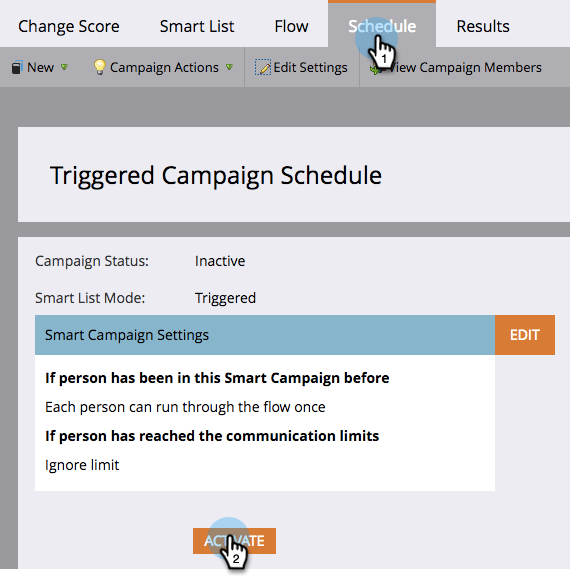

# 啟動觸發程式智慧型行銷活動 |計畫頁簽 {#activate-a-trigger-smart-campaign-schedule-tab}

啟動觸發程式智慧型行銷活動就像開啟它一樣。 這是該做什麼。

1. 在聰明的 **排程** 按一下 **啟動**.

   

   >[!TIP]
   >
   >先檢閱智慧型促銷活動，再啟動。

1. 按一下 **啟動** 。

   

   >[!CAUTION]
   >
   >在按一下「啟動」之前，請確定促銷活動已就緒！

從現在開始，符合智慧清單資格的任何人，都會經過智慧行銷活動所定義的流程。
