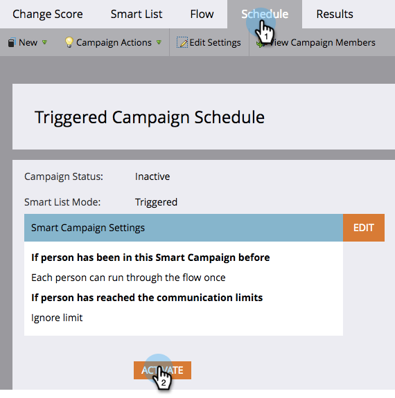

# 啟動觸發智慧型行銷活動 | 排程標籤 {#activate-a-trigger-smart-campaign-schedule-tab}

啟用觸發程式Smart Campaign就像開啟。 以下說明該怎麼做。

1. 在Smart Campaign的&#x200B;**[!UICONTROL 排程]**&#x200B;索引標籤中，按一下&#x200B;**[!UICONTROL 啟用]**。

   

   >[!TIP]
   >
   >在啟用之前先檢閱Smart Campaign。

1. 再按一下&#x200B;**[!UICONTROL 啟動]**。

   

   >[!TIP]
   >
   >啟動之前，請確定行銷活動已準備就緒！

從此刻起，任何符合智慧清單資格的人都會透過您的Smart Campaign所定義的流程。
