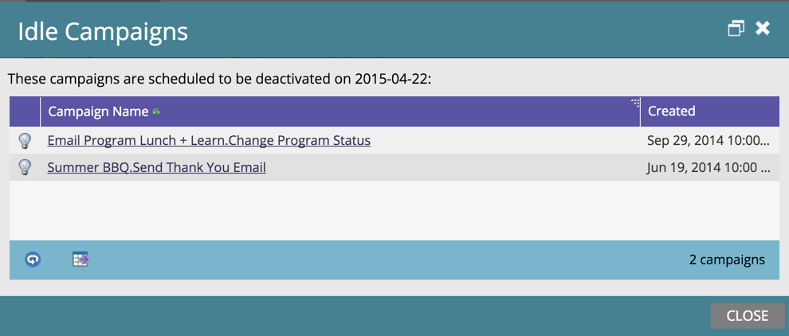
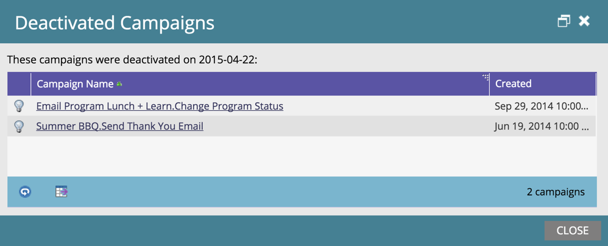

# 自動觸發促銷活動清除 {#automatic-trigger-campaign-cleanup}

Marketo提供不錯/免費服務，可停用已觸發且無法再取得活動的智慧型促銷活動。 這可加快整體系統效能並節省時間。

## 怎麼了？ {#what-happens}

每季一次，Marketo會找到休眠（無人）達6個月或更久的智慧型行銷活動，並將其停用。

## 你會先通知我嗎？ {#will-you-notify-me-first}

當然！ 每季一次，您會在一週前收到通知，顯示我們計畫停用的每個促銷活動。

1. 前往 **通知** 標籤。

   

1. 按一下 **已排程空閒觸發程式促銷活動清除**. 然後按一下 **這些閒置觸發程式促銷活動將會停用** 連結。

   

   您會看到已排程停用的智慧型促銷活動清單。

   

## 將停用哪些促銷活動？ {#which-campaigns-will-be-deactivated}

我們只會停用已生效超過6個月，但在該時段內符合0人資格的觸發促銷活動。

## 等等！ 不是這次競選！ {#wait-not-this-campaign}

別擔心 — 任何智慧行銷活動的時鐘都可透過下列方式重設：

* 符合促銷活動資格的人員。
* 手動停用和重新啟用促銷活動。

兩者皆會重設6個月計數器。

## 您可以通知我已停用的促銷活動嗎？ {#will-you-let-me-know-which-campaigns-were-deactivated}

絕對 — 在原始通知後一週，我們會停用列出的促銷活動（減去任何符合資格的至少一個人員，或已停用/重新啟用），並發佈確認通知。

1. 選取 **已排程空閒觸發程式促銷活動清除** 通知。 按一下 **這些空閒觸發促銷活動** 連結。

   

1. 您會看到停用中促銷活動的清單。

   
