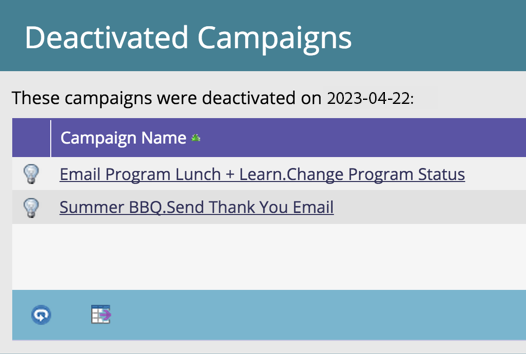

# 自動觸發行銷活動清理 {#automatic-trigger-campaign-cleanup}

Marketo有很好/免費的服務，可以停用已觸發且不再有活動的智慧行銷活動。 這樣可加快整體系統效能並節省您的時間。

## 會發生什麼事？ {#what-happens}

Marketo每個季度會發現閒置（無人員）6個月或以上的智慧行銷活動，並將其停用。

## 您會先通知我嗎？ {#will-you-notify-me-first}

當然！ 每季一次，您會提前一週收到通知，顯示我們計畫停用的每個行銷活動。

1. 按一下 **通知** 圖示。

   

1. 按一下 **已排定閒置觸發程式促銷活動清理**. 然後按一下 **這些閒置的觸發程式行銷活動將會停用** 連結。

   

   您會看到已排程停用的智慧行銷活動清單。

   

## 將停用哪些行銷活動？ {#which-campaigns-will-be-deactivated}

我們只會停用已有效超過6個月，但在該時段內有0人符合資格的觸發促銷活動。

## 等一下！ 不是此行銷活動！ {#wait-not-this-campaign}

別擔心 — 任何智慧行銷活動的時鐘都可由以下方式重設：

* 符合行銷活動資格的人。
* 手動停用及重新啟動行銷活動。

兩者都會重設6個月的計數器。

## 您是否能告知我哪些行銷活動已停用？ {#will-you-let-me-know-which-campaigns-were-deactivated}

絕對 — 在原始通知後一週，我們將停用列出的行銷活動（減去任何符合條件至少有一個人或已停用/重新啟用的行銷活動），並發佈確認通知。

1. 選取 **已排定閒置觸發程式促銷活動清理** 通知。 按一下 **這些閒置的觸發程式行銷活動** 連結。

   

1. 您將會看到已停用行銷活動的清單。

   
