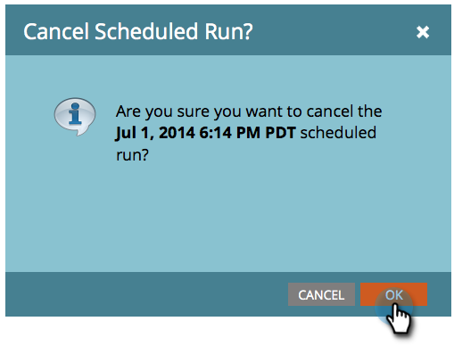

# 取消已排程的批次促銷活動執行 {#cancel-a-scheduled-batch-campaign-run}

如果您已為其中一個批次促銷活動排程執行，但想取消，以下說明方法。

1. 選取促銷活動，然後前往 **排程** 標籤。

   

1. 找到要取消的計畫運行，然後按一下 **x** 旁邊。

   

1. 按一下以確認取消 **確定**.

   

>[!NOTE]
>
>如果運行已啟動，則執行此操作將無濟於事。 當您決定未來需要取消執行時，請使用此功能。
