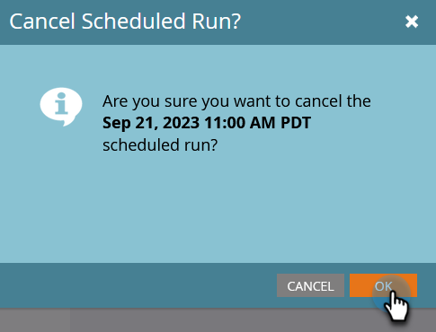

# 取消已安排的批次行銷活動執行 {#cancel-a-scheduled-batch-campaign-run}

如果您已排程其中一個批次行銷活動的執行，並且想要取消它，則請依照以下說明進行。

1. 選取行銷活動並前往&#x200B;**[!UICONTROL Schedule]**&#x200B;標籤。

   

1. 找到您要取消的排程執行，然後按一下它旁邊的&#x200B;**x**。

   

1. 按一下&#x200B;**[!UICONTROL OK]**&#x200B;以確認取消。

   

>[!NOTE]
>
>如果執行已開始，則執行此動作沒有幫助。 當您決定未來需要取消執行時，請使用此選項。
