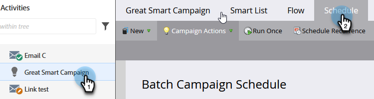

# 取消已安排的定期批次行銷活動執行 {#cancel-a-scheduled-recurring-batch-campaign-run}

如果您有不想再發生的重複批次促銷活動，可以取消未來的執行。

1. 選取Smart Campaign，然後按一下&#x200B;**排程**&#x200B;索引標籤。

   

1. 按一下「**[!UICONTROL Schedule Recurrence]**」。

   

   >[!TIP]
   >
   >您可以按一下單一回合旁邊的來取消單一回合。 瞭解如何[取消已排程的批次行銷活動執行](/help/marketo/product-docs/core-marketo-concepts/smart-campaigns/using-smart-campaigns/cancel-a-scheduled-batch-campaign-run.md){target="_blank"}。

1. 將排程設定為&#x200B;**[!UICONTROL None]**&#x200B;並按一下&#x200B;**[!UICONTROL Save]**。

   

   瞧！ 您的Smart Campaign將不再執行。

   >[!CAUTION]
   >
   >這會取消未來的執行，但如果Smart Campaign正在執行中，則無法取消。

   >[!MORELIKETHIS]
   >
   >[取消排定的批次行銷活動執行](/help/marketo/product-docs/core-marketo-concepts/smart-campaigns/using-smart-campaigns/cancel-a-scheduled-batch-campaign-run.md){target="_blank"}
