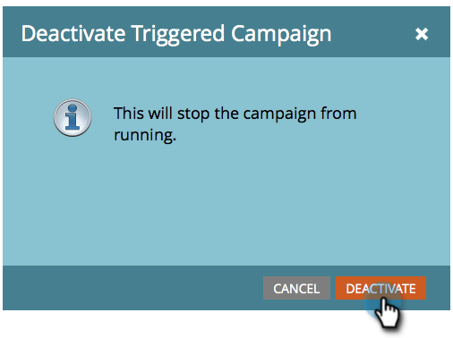

# 停用觸發智慧型行銷活動 | 排程標籤 {#deactivate-a-trigger-smart-campaign-schedule-tab}

如果您有需要停用的舊觸發程式行銷活動，請依照下列步驟操作：

1. 尋找並選取您的作用中觸發程式行銷活動。

   

1. 在[排程]索引標籤下，按一下[**[!UICONTROL 停用]**]。

   

1. 按一下&#x200B;**[!UICONTROL 停用]**&#x200B;以確認。

   

>[!NOTE]
>
>這會阻止&#x200B;_新_&#x200B;人員進入流程，但處於等候步驟或任何其他流程步驟的人員將繼續在流程中移動，直到完成為止。
