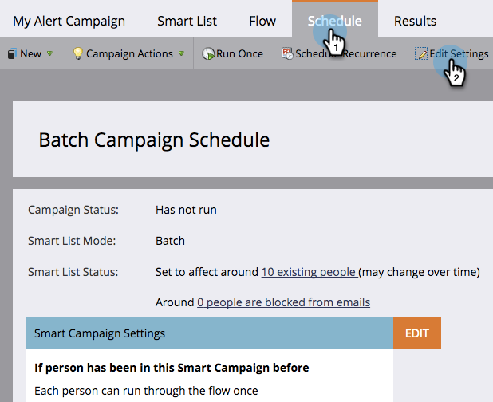

# 在智慧型行銷活動中編輯資格規則 {#edit-qualification-rules-in-a-smart-campaign}

資格規則可控制某人在智慧行銷活動中執行流量的次數。 依預設，即使某人觸發智慧型促銷活動多次，也只會透過流程傳送一次。 以下說明如何修改這些設定。

1. 在您的智慧型行銷活動中，按一下 **排程** 標籤，然後 **編輯設定**.

   

   >[!TIP]
   >
   >您也可以按一下 **編輯** 「智慧行銷活動設定」的右側。

1. 選擇透過智慧行銷活動流程執行人員的頻率： **僅一次**, **每次都**，或 **每天**/**周**/**月份**.

   

   >[!NOTE]
   >
   >當您每天設定一次規則時，Marketo會將該規則轉換為小時。 例如，如果您每天設定一次規則，而某個人在週日晚上10點符合資格，則要到星期一晚上10點才能再次符合資格。 使用周或月時，此邏輯也適用。 一個月一律計為30天。

   >[!NOTE]
   >
   >預設不會將通訊限制套用至智慧型促銷活動。 了解如何 [將通訊限制套用至智慧型行銷活動](/help/marketo/product-docs/core-marketo-concepts/smart-campaigns/using-smart-campaigns/apply-communication-limits-to-smart-campaign.md).

   >[!NOTE]
   >
   >[將通訊限制套用至智慧型行銷活動](/help/marketo/product-docs/core-marketo-concepts/smart-campaigns/using-smart-campaigns/apply-communication-limits-to-smart-campaign.md)

任務完成了！ 您現在知道如何在智慧型行銷活動中控制資格規則。
