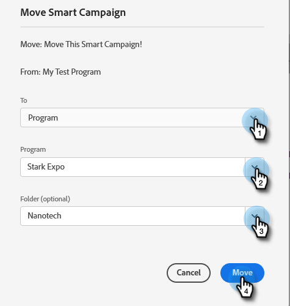

# 移動智慧行銷活動 {#move-a-smart-campaign}

使用拖放或樹狀結構中的移動功能，在不同程式或資料夾之間移動Smart Campaign。 您的Smart Campaign規則不會變更，只會巢狀內嵌在不同位置。

>[!CAUTION]
>
>由於規則不會變更，如果行銷活動的智慧清單或流程步驟參考原始程式，您必須手動更新該資訊以反映其新程式，因為它&#x200B;_不會_&#x200B;自動更新。

1. 前往 **[!UICONTROL Marketing Activities]**。

   

1. 找到您要移動的Smart Campaign，用滑鼠右鍵按一下並選取&#x200B;**[!UICONTROL Move]**。

   

1. 選取&#x200B;**[!UICONTROL To]** （目的地）、**[!UICONTROL Program]**&#x200B;和選用的&#x200B;**[!UICONTROL Folder]**。 選取「**[!UICONTROL Move]**」。

   

   >[!NOTE]
   >
   >在此範例中，Smart Campaign正移至其他方案，但您也可以將其移至行銷活動資料夾。

已移動Smart Campaign。

