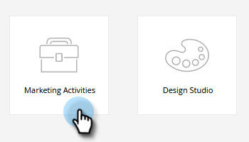

# 移動智慧型行銷活動 {#move-a-smart-campaign}

使用拖放或樹狀結構中的移動功能，在不同程式或資料夾之間移動智慧型行銷活動。 您的智慧型行銷活動的規則不會變更，只會巢狀內嵌在不同位置。

>[!CAUTION]
>
>由於規則不會變更，因此如果行銷活動的「智慧列示」或「流程步驟」參考原始方案，您必須手動更新該資訊，以反映其新方案（如預期的那樣） **非** 自動更新。

1. 前往 **行銷活動**.

   

1. 找到您要移動的Smart Campaign，用滑鼠右鍵按一下並選取 **移動**.

   

1. 選取 **至** （目的地）， **計畫**，和選填 **資料夾**. 選取 **移動**.

   

   >[!NOTE]
   >
   >在此範例中，我們將Smart Campaign移至另一個方案，但您也可以將其移至促銷活動資料夾。

做得好！ 已移動Smart Campaign。

