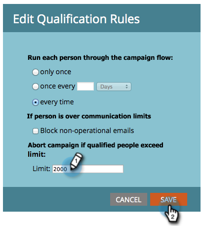

# 在智慧型促銷活動中覆寫人員限制{#override-person-restrictions-in-a-smart-campaign}

Marketo可讓您設定最多人數，讓您符合智慧型宣傳的資格；這有助於您避免意外以電子郵件寄送整個資料庫。 如果您想要&#x200B;_override_&#x200B;此限制，請參閱以下說明。

>[!PREREQUISITES]
>
>請務必在「Marketo管理員」中為智慧型促銷活動](/help/marketo/product-docs/administration/email-setup/enable-person-restrictions-for-smart-campaigns.md)啟用人員限制。[

1. 在「行銷活動」中，前往您的智慧型促銷活動，然後按一下「排程&#x200B;**」。**

   

1. 在智慧型促銷活動設定中，按一下「編輯」**。**

   

   >[!NOTE]
   >
   >預設限制是「管理」中設定的限制。

1. 輸入新限制，然後按一下「保存」。****

   

   如果符合資格的人數超過設定的限制，智慧型促銷活動將不會執行。

   >[!CAUTION]
   >
   >請小心這項功能，以免意外包含太多人。
