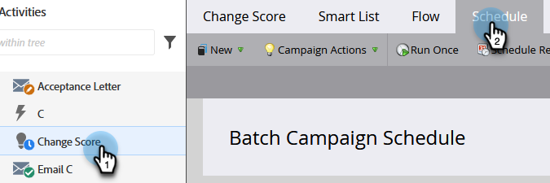

# 覆寫智慧行銷活動中的人員限制 {#override-person-restrictions-in-a-smart-campaign}

Marketo可讓您設定符合智慧行銷活動資格的人數上限；這可協助您避免意外傳送電子郵件給整個資料庫。 如果您想要 _覆寫_ 此限制如下。

>[!PREREQUISITES]
>
>請確定 [為智慧行銷活動啟用人員限制](/help/marketo/product-docs/administration/email-setup/enable-person-restrictions-for-smart-campaigns.md) 在Marketo Admin中。

1. 在行銷活動中，前往您的智慧行銷活動並按一下 **排程**.

   

1. 在Smart Campaign設定中，按一下 **編輯**.

   

   >[!NOTE]
   >
   >預設限製為「管理員」中設定的限制。

1. 輸入新限制，然後按一下 **儲存。**

   

   如果符合資格的人數超過設定的限制，則智慧型行銷活動不會執行。

   >[!CAUTION]
   >
   >使用此功能時請務必小心，以免不小心納入太多人員。
