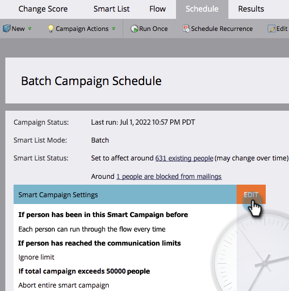

# 覆寫智慧行銷活動中的人員限制 {#override-person-restrictions-in-a-smart-campaign}

Marketo Engage可讓您設定符合Smart Campaign資格的人數上限；這可協助您避免意外傳送電子郵件給整個資料庫。 若您要&#x200B;_覆寫_&#x200B;此限制，請依下列方法操作。

>[!PREREQUISITES]
>
>請務必在Marketo管理員中[啟用智慧行銷活動的人員限制](/help/marketo/product-docs/administration/email-setup/enable-person-restrictions-for-smart-campaigns.md){target="_blank"}。

1. 在&#x200B;**[!UICONTROL 行銷活動]**&#x200B;中，移至您的Smart Campaign並按一下&#x200B;**[!UICONTROL 排程]**。

   

1. 在Smart Campaign設定中，按一下&#x200B;**[!UICONTROL 編輯]**。

   

   >[!NOTE]
   >
   >預設限製為「管理員」中設定的限制。

1. 輸入新的限制，然後按一下[儲存]。**&#x200B;**

   

   如果符合資格的人數超過設定的限制，Smart Campaign將不會執行。

   >[!CAUTION]
   >
   >使用此功能時請小心，以免意外包含太多人員。
