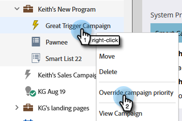

# 觸發器行銷活動的優先順序覆寫 {#priority-override-for-trigger-campaigns}

管理員可以覆寫Marketo所確定的觸發行銷活動的優先順序，以設定更符合業務目標的優先順序。

>[!NOTE]
>
>此功能僅適用於觸發行銷活動和已授與的使用者。 [「編輯觸發促銷活動優先順序」許可權](#grant-priority-override-access).

>[!CAUTION]
>
>強烈建議您將此功能用於有限的一組關鍵業務行銷活動（建議的最大值為25）。 在大型集上寬鬆地使用此功能，可能會對整體行銷活動的執行產生負面影響。

## 授予優先順序覆寫存取權 {#grant-priority-override-access}

>[!NOTE]
>
>只有管理員或負有管理員責任的使用者才應該擁有行銷活動優先順序覆寫存取權。

1. 在 [!UICONTROL 管理員] 區域，按一下 **[!UICONTROL 使用者和角色]**.

   

1. 按一下 **[!UICONTROL 角色]** 索引標籤中，選取您要授與存取許可權的使用者，然後按一下 **[!UICONTROL 編輯角色]**.

   

1. 下 [!UICONTROL 存取行銷活動]，選取 **[!UICONTROL 編輯觸發程式行銷活動優先順序]**. 按一下 **[!UICONTROL 儲存]**.

   

## 覆寫優先順序 {#override-priority}

1. 找出您的觸發程式行銷活動。 以滑鼠右鍵按一下並選取 **[!UICONTROL 覆寫行銷活動優先順序]**.

   

1. 按一下 **[!UICONTROL 覆寫行銷活動優先順序]** 要啟用的滑桿。 選擇新的優先順序層級，然後按一下 **[!UICONTROL 確認]**.

   

   新的優先順序層級將顯示在「排程」標籤中。

   

>[!NOTE]
>
>* 您可以在以下位置檢視行銷活動的預設優先順序： [!UICONTROL 行銷活動佇列] 在 [!UICONTROL 行銷活動]. 若要提高執行率，建議將行銷活動優先順序設定為比預設值高一個等級。
>* 使用者設定優先順序僅適用於符合促銷活動資格的新使用者；已進入佇列的使用者則不受影響。
>* 優先順序覆寫記錄於 [稽核軌跡](/help/marketo/product-docs/administration/audit-trail/audit-trail-overview.md).
